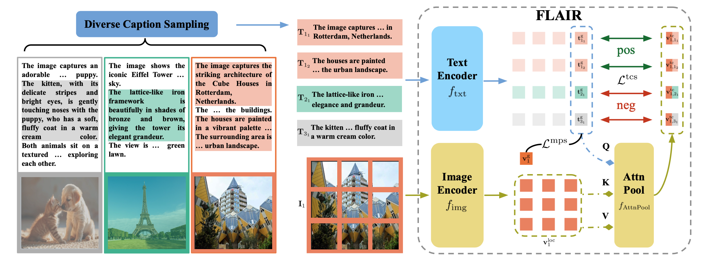

# FLAIR: VLM with Fine-grained Language-informed Image Representations [arxiv](https://arxiv.org/abs/2412.03561)
**Authors:** Rui Xiao, Sanghwan Kim, Mariana-Iuliana Georgescu, Zeynep Akata, Stephan Alaniz

## Abstract
CLIP has shown impressive results in aligning images and
texts at scale. However, its ability to capture detailed visual features remains limited because CLIP matches images and texts at a global level. To address this issue, we propose **FLAIR**, **F**ine-grained **La**nguage-informed **I**mage
**R**epresentations, an approach that utilizes long and detailed image descriptions to learn localized image embed
dings. By sampling diverse sub-captions that describe fine-grained details about an image, we train our vision-
language model to produce not only global embeddings but also text-specific image representations. Our model
introduces text-conditioned attention pooling on top of local image tokens to produce fine-grained image representations that excel at retrieving detailed image content. We achieve state-of-the-art performance on both, existing mul-
timodal retrieval benchmarks, as well as, our newly introduced fine-grained retrieval task which evaluates vision-
language models’ ability to retrieve partial image content. Furthermore, our experiments demonstrate the effectiveness of FLAIR trained on 30M image-text pairs in capturing fine-grained visual information, including zero-shot semantic segmentation, outperforming models trained on billions of pairs.

## Methodology


## Pre-trained Models

We released the pre-trained FLAIR models on [Huggingface](https://huggingface.co/xiaorui638/flair). The pre-trained models and their corresponding datasets are listed below:

| **Checkpoints**                                                                                            | **Pre-trained Datasets** |
|------------------------------------------------------------------------------------------------------------|--------------------------|
| [flair-cc3m-recap](https://huggingface.co/xiaorui638/flair/resolve/main/flair-cc3m-recap.pt?download=true) | CC3M-recap               |
| [flair-cc12m-recap](https://huggingface.co/xiaorui638/flair/resolve/main/flair-cc12m-recap.pt?download=true) | CC12M-recap              |
| [flair-yfcc15m-recap](https://huggingface.co/xiaorui638/flair/resolve/main/flair-yfcc15m-recap.pt?download=true) | YFCC15M-recap            |
| [flair-merged30m](https://huggingface.co/xiaorui638/flair/resolve/main/flair-merged30m.pt?download=true)   | Merged30M                |

## Dependencies
The following small tutorial helps you set up a simple python virtual environment to run our code. Since our main dependency is [OpenCLIP](https://github.com/mlfoundations/open_clip), which is still updated frequently, you could always check their repo for a detailed tutorial on creating an environment that is best suited for your system. A conda environment is also possible with the same Python and PyTorch version.
### 1. Create a Virtual Environment
First, navigate to the project’s root directory `flair/` and create a virtual environment using Python 3.12:
```bash
cd flair/
python3.12 -m venv flair_env
```
### 2. Activate and Navigate to src/
Activate the virtual environment and navigate to `src/`
```bash
source flair_env/bin/activate
cd src/
```

### 3. Install Dependencies
Our code mainly involves installing `open_clip_torch` and `open_clip_torch[training]`.
```bash
pip install --upgrade pip
pip install torch torchvision torchaudio --index-url https://download.pytorch.org/whl/cu124
pip install -r requirements.txt
```
The code is tested in Python 3.12 with PyTorch 2.5.1 with CUDA 12.4. Since [OpenCLIP](https://github.com/mlfoundations/open_clip) is quite dependency-friendly, we would assume other up-to-date versions should also work.


## Dataset Preparation
Check [EVAL_DATASETS.md](datasets/EVAL_DATASETS.md) to prepare all the inference datasets. For clarity, we provide an example datasets folder with annotation files in `datasets/`. However, all datasets don't have to be stored in the same directory, you could specify them freely by changing the arguments in `src/inference.sh`.

## Inference with FLAIR
To reproduce the retrieval results in the FLAIR paper, we provide an example inference bash script: `src/inference.sh`. Below are detailed explanations of important flags:

- `--huggingface-repo-name`: Name of the Huggingface repo where the pre-trained models are stored. Should be fixed as `'xiaorui638/flair'`.
- `--huggingface-model-name`: Name of the pretrained models. Options include:
  - `flair-cc3m-recap.pt`
  - `flair-cc12m-recap.pt`
  - `flair-yfcc15m-recap.pt`
  - `flair-merged30m.pt`
- `--inference-with-flair`: Enable this flag when using the FLAIR model.
- `--precision`: Fixed as `amp` in our paper.
- `--workers`: Adjustable according to your system.

### Retrieval Tasks
Enable the following flags in `src/inference.sh` for different retrieval tasks:

1. **Standard Retrieval**
   - `--coco-data-root-dir`: Root directory of the COCO dataset.
   - `--flickr-data-root-dir`: Root directory of the Flickr30k dataset.
   - `--retrieval-coco`: Activate the COCO retrieval task.
   - `--retrieval-flickr`: Activate the Flickr retrieval task.
2. **Fine-grained Retrieval**
   - `--iiw-retrieval-dir`: Root directory of the Image-in-Words dataset.
   - `--docci-retrieval-dir`: Root directory of the DOCCI dataset.
   - `--retrieval-iiw`: Activate the Image-in-Words retrieval task.
   - `--retrieval-docci`: Activate the DOCCI retrieval task.
3. **Long Retrieval**
   - `--dci-retrieval-dir`: Root directory of the DCI dataset.
   - `--urban-1k-retrieval-dir`: Root directory of the Urban-1K dataset.
   - `--sharegpt4v-retrieval-dir`: Root directory of the ShareGPT4V dataset.
   - `--retrieval-dci`: Activate the DCI retrieval task.
   - `--retrieval-urban-1k`: Activate the Urban1K retrieval task.
   - `--retrieval-sharegpt4v-1k`: Activate the ShareGPT4V-1K retrieval task.
   - `--retrieval-sharegpt4v-10k`: Activate the ShareGPT4V-10K retrieval task.

## Acknowledgements
We thank [OpenCLIP](https://github.com/mlfoundations/open_clip) for providing the amazing code base. Meanwhile, we acknowledge [DreamLIP](https://github.com/zyf0619sjtu/DreamLIP) and [PixelProse](https://huggingface.co/datasets/tomg-group-umd/pixelprose) for providing us with various pre-training datasets with captions from MLLMs. We are also greateful for [LoTLIP](https://github.com/wuw2019/LoTLIP) for providing the the detailed scheme for long image-text retrieval task.

## Citations
If you find our work useful, please cite:

```bibtex
@article{xiao2024flair,
  title={FLAIR: VLM with Fine-grained Language-informed Image Representations},
  author={Xiao, Rui and Kim, Sanghwan and Georgescu, Mariana-Iuliana and Akata, Zeynep and Alaniz, Stephan},
  journal={arXiv preprint arXiv:2412.03561},
  year={2024}
}

